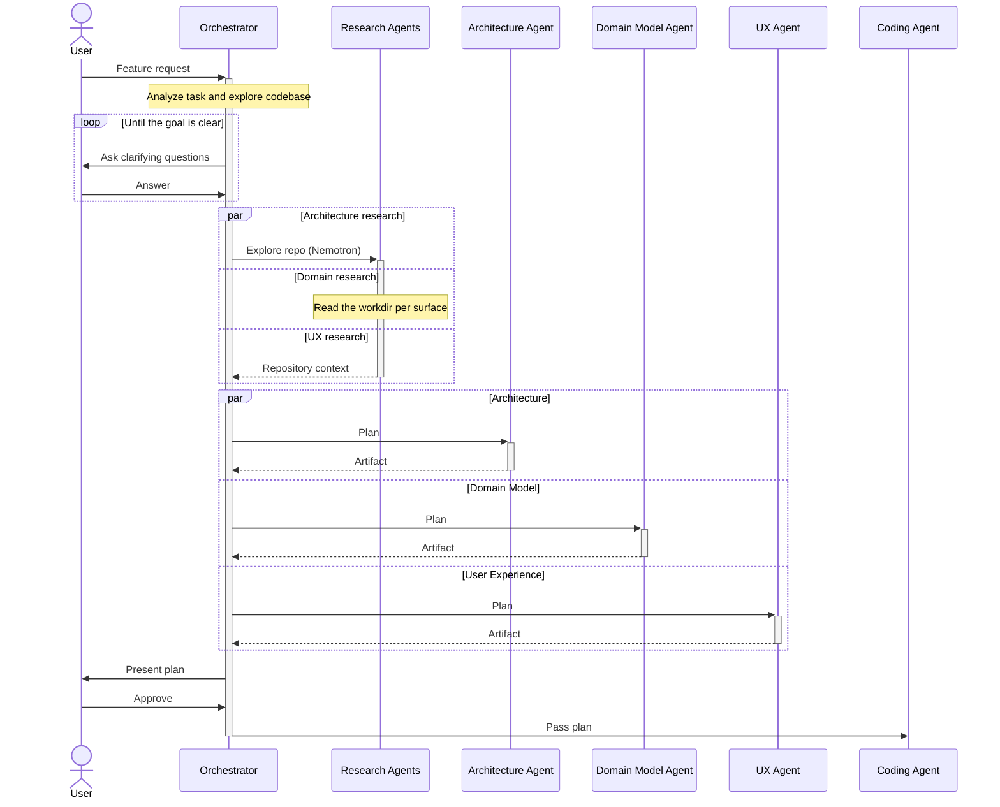

# 🐳 Inference Hackathon

_A better interface for scoping work for autonomous coding agents._

Built for [Whale]'s [Inference Hackathon], which asks one question:

> If you had unlimited compute, what autonomous agent system would you build?

![Chatting with the agent about the work][screenshot-chat]
_Chat with the agent about the work_

![Reviewing the plan as high-fidelity diffs][screenshot-diff]
_Review the plan as high-fidelity diffs_

## The Bet

Coding harnesses like Claude Code keep getting better at carrying out complex
work on their own. As they do, the bottleneck moves: it is no longer _writing_
the code, it is _deciding what to build_. The frontier is goal-setting.

Today's interface for that hand-off is a chat box and an 800-line `plan.md`.
That does not cut it. Prose plans are impossible to review at a glance, they
hide the decisions that actually matter, and they drift out of sync the moment
you change your mind. As agents ship more work faster, scoping becomes the
thing that slows everyone down.

So we built the interface for the part humans should still own: framing the
change, seeing its consequences, and approving a plan worth handing off.

## What We Built

You give the tool a feature request. Instead of a wall of text, it does what a
good engineer does before writing code — it interrogates the task and reads the
codebase until it understands both, then shows you the change across the three
surfaces an engineer actually reasons about:

1. **Architecture** — the components, surfaces, and technical decisions the
   change touches.
2. **Domain Model** — how the change moves the ubiquitous language and the
   entities behind it.
3. **User Experience** — what the change means for the interface, shown as
   wireframes or high-fidelity mocks.

Each surface is a **diffable artifact**, not prose: architecture and the domain
model are graphs with stable IDs, so a change reads as added, removed, or
rerouted edges — the same way a code review reads. You iterate on the artifacts,
approve them, and only then does the tool compile them into a `plan.md` for the
coding agent.

## How It Works

A single orchestrator drives the session. It interrogates the task and explores
the codebase, asking clarifying questions until the goal is unambiguous. From
there it splits the work along the three surfaces a change actually moves
along — architecture, the domain model, and the user experience — and handles
each as its own track rather than one undifferentiated plan.

Every surface gets a specialist. A research agent reads the repo for that
surface, then an artifact agent drafts the change in the form that surface is
best reviewed in: a diffable graph for architecture and the domain model, a
wireframe or high-fidelity mock for the UX. The tracks run in parallel and
stream back to the UI, so you review the change the way you reason about it —
one surface at a time, each in its own language — rather than digging the
architecture, data, and interface implications out of a wall of prose.



## Where We Pushed

**Grounded by a Nemotron research swarm.** Before any artifact is drafted, a
group of [Nemotron]-powered research agents — one per surface — reads the actual
working directory to learn how the repository works today. Each maps the
project, searches for the concepts the change touches, and reads the files that
matter, then hands the artifact agents grounded context: relevant paths, likely
touchpoints, and the conventions to honor. It is a deliberate cost-quality
trade-off — a cheap model does the broad, parallel reading so the capable models
can spend their budget on the careful authoring — and it keeps the proposed
changes anchored to the real code rather than the prompt alone.

**The MetaLoop keeps the plan consistent.** The three artifacts are not
independent. Edit the architecture and the domain-model and UX agents
re-examine their own artifacts against that change, reconciling automatically —
and escalating back to you with a question when the change forces a genuine
decision. This cross-artifact reconciliation is the MetaLoop: the plan stays
internally consistent as you iterate, instead of fracturing into three
documents that quietly contradict each other.

## The Demo

1. Start with a new feature request or user story.
2. Kick off the planning process: the orchestrator reviews the input and asks
   clarifying questions, tuned to unblock the design.
3. Iterate on the artifacts. Editing one can trigger goal-oriented loops on the
   others — the MetaLoop — which may escalate back to you for a decision.
4. Approve the artifacts and merge them into a `plan.md` for the coding agent.

## How It's Built

A local-first desktop app. Planning runs as an event-driven loop: an
orchestrator interrogates the user, fans work out to per-surface specialist
agents, and streams their artifacts back to the UI. The stack is a [Tauri]
shell with a [React] frontend and a [Mastra] agent runtime, all in a [Bun]
TypeScript monorepo so the UI, the agents, and the shared domain model speak one
language.

| Decision                  | Why                                            |
| ------------------------- | ---------------------------------------------- |
| Tauri v2 (Rust + webview) | Local-first desktop; native FS/process access  |
| Bun + TS monorepo         | One language across UI, agents, and core       |
| Mastra agent runtime      | Typed tools, suspendable workflows, and memory |
| Event-driven planning     | Stream questions and artifact diffs to the UI  |
| Structured artifacts      | Diffable graphs with stable IDs, not prose     |
| Nemotron repo research    | Ground artifacts in the real code, cheaply     |

Orchestration uses Mastra **workflows** rather than agent networks: the initial
plan is one suspendable run, where clarifying and approving are
human-in-the-loop suspensions, and the MetaLoop is event-triggered reconcile
runs. The agents run on Mastra in a Bun sidecar — Mastra is Node, Tauri is not.
Logic lives in platform-independent `packages/` (no Tauri, easy to test);
`apps/` holds the desktop shell.

[bun]: https://bun.sh
[inference hackathon]: https://luma.com/whale-t8hg
[mastra]: https://github.com/mastra-ai/mastra
[nemotron]: https://developer.nvidia.com/nemotron
[react]: https://react.dev
[screenshot-chat]: ./screenshot-chat.png
[screenshot-diff]: ./screenshot-diff.png
[tauri]: https://tauri.app
[whale]: https://www.whale-academy.com/

---

Our plan ("us") vs claude code's plan mode ("them"), note failure is a false negative.

```
Run 1/5
  us             run 1: fail  608s  $4.368  234 lines
  them           run 1: fail  222s  $2.445  221 lines
Run 2/5
  us             run 2: fail  937s  $5.706  234 lines
  them           run 2: fail  203s  $2.468  220 lines
Run 3/5
  us             run 3: fail  655s  $3.600  220 lines
  them           run 3: fail  218s  $2.297  220 lines
```
