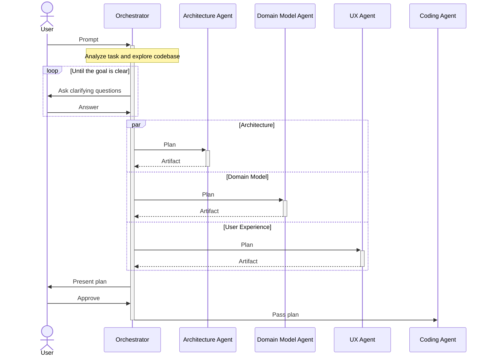

# Inference Hackathon

_A better interface for scoping work for autonomous coding agents._

We are participating in [Whale]'s [Inference Hackathon], which explores the
following idea:

> If you have unlimited compute, what autonomous agent system would you build?

Our hypothesis is that coding harnesses like Claude Code will keep improving at
a great pace, getting better and better at handling complex tasks autonomously.
This enables developers to shift their focus left: scope work and set goals, and
then hand off the work to coding agents.

We strongly believe that the current interfaces between developers and agents
are fundamentally unsuitable for such a world. As agents deliver more work more
quickly, scoping that work becomes the bottleneck. Passing a GitHub Issue to
Claude and then reviewing an 800 line `plan.md` doesn't cut it anymore...

## A Better Interface

When passing a task to our tool, agents start analyzing it and exploring the
codebase. They ask clarifying questions until they fully understand the user's
goal and the code.

Then, they describe the required changes across three different surfaces:

1. **Architecture**: What changes to the application's architecture are
   required?
2. **Domain Model**: How does the change touch the domain model?
3. **User Experience**: Does the change require changes to the application's
   user interface or experience?

The findings are presented as easy-to-parse artifacts that match the surface
area. Changes to the UI are surfaced as wireframes or high-fidelity mocks,
changes to the architecture and domain model as diffable graphs.

## Planning Process

## Architecture

Lontra is a local-first desktop app. Planning runs as an event-driven
loop: an orchestrator interrogates the user, fans work out to per-surface
specialist agents, and streams their artifacts back to the UI. The stack
is a [Tauri] shell with a [React] frontend and a [Mastra] agent runtime,
all in a [Bun] TypeScript monorepo so the UI, the agents, and the shared
domain model speak one language.

### Decisions

| Decision                  | Why                                           |
| ------------------------- | --------------------------------------------- |
| Tauri v2 (Rust + webview) | Local-first desktop; native FS/process access |
| Bun + TS monorepo         | One language across UI, agents, and core      |
| Mastra agent runtime      | Typed tools, workflows, and memory            |
| Event-driven planning     | Stream questions and artifact diffs to the UI |
| Structured artifacts      | Diffable graphs with stable IDs, not prose    |
| oxc + tsgo + Flox         | Fast, reproducible lint, format, and builds   |

### Workflow Model

- Orchestration uses Mastra **workflows**, not agent networks.
- The initial plan is one suspendable workflow run (clarify and approve are
  human-in-the-loop suspensions); the MetaLoop is event-triggered reconcile
  runs.
- Agents run on Mastra in a Bun sidecar — Mastra is Node, Tauri is not.

### Repository Structure

- `apps/` — the platform-specific shell (currently a Tauri + React app).
- `packages/` — as much of the logic as possible, kept platform-independent
  (no Tauri) and easily testable.

[bun]: https://bun.sh
[inference hackathon]: https://luma.com/whale-t8hg
[mastra]: https://github.com/mastra-ai/mastra
[react]: https://react.dev
[tauri]: https://tauri.app
[whale]: https://www.whale-academy.com/
