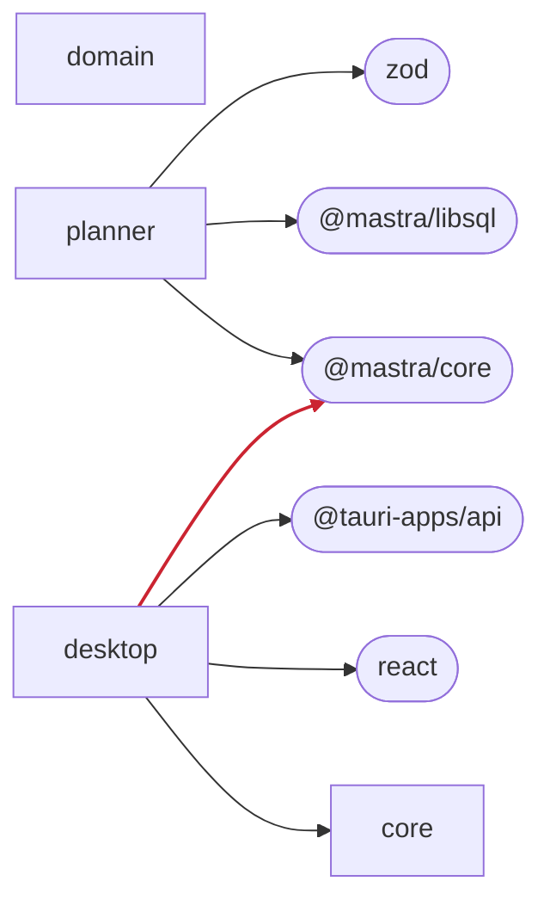

# Architecture Review (Example)

<!-- Generated from `packages/architecture`. Run `just render-architecture` to update. -->

A proposed change — the desktop webview calling the model runtime directly —
checked against Lontra's architectural rules. The report classifies every rule,
and the graph reddens the offending dependency so the violation is visible at a
glance rather than buried in a diff.

## Report

Architecture check: 1 violated, 0 at-risk, 3 preserved

### Violated

- mastra-only-in-sidecar — @inference-hackathon/desktop depends on @mastra/core
  Mastra is Node-only and owns secrets and run state; it lives in the planner sidecar, never the webview or Rust shell

### Preserved

- platform-independent-core
- no-ui-in-shared
- dependencies-point-inward

## Diagram

