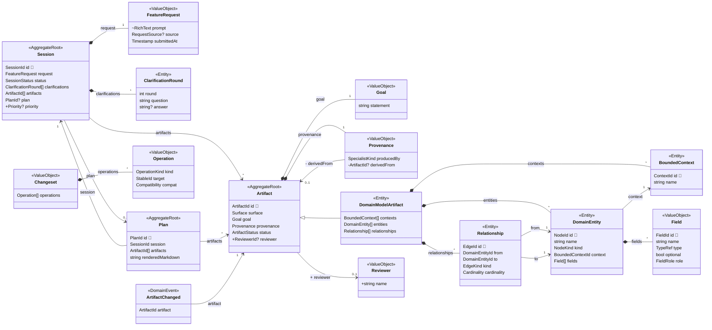

# Lontra Domain Model Diff (Example)

<!-- Generated from `packages/domain`. Run `just render-domain-diff` to update. -->

An example review: the changeset a planning agent might propose against Lontra's
own model, shown two ways. Each operation is classified so a reviewer's eye goes
to the breaking changes first. The graph overlays both versions — added nodes
are green, removed red, modified amber — and field and edge changes are marked
`+` (added), `-` (removed), and `~` (changed).

## Changeset

7 changes (3 breaking, 3 additive, 1 cosmetic)

### Breaking

- Retype FeatureRequest.prompt: string to RichText
- Add invariant on Artifact: An Artifact must have a Reviewer before it is Approved
- Remove Provenance.derivedFrom

### Additive

- Add ValueObject Reviewer
- Add Session.priority: Priority
- Add Artifact.reviewer: → Reviewer

### Cosmetic

- Rename Clarification to ClarificationRound

## Diagram

